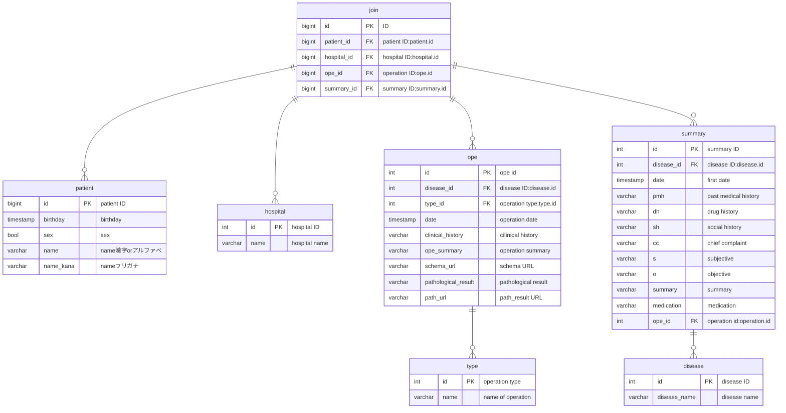

```mermaid

---
title:"MyKarte"
---

erDiagram
    join ||--o{ patient : ""
    join ||--o{ hospital : ""
    join ||--o{ ope : ""
    join ||--o{ summary : ""
    summary ||--o{ disease : ""
    ope ||--o{ type : ""

    join {
        bigint id PK "ID"
        bigint patient_id FK "patient ID:patient.id"
        bigint hospital_id FK "hospital ID:hospital.id"
        bigint ope_id FK "operation ID:ope.id"
        bigint summary_id FK "summary ID:summary.id"
    }

    patient {
        bigint id PK "patient ID"
        timestamp birthday "birthday"
        bool sex "sex"
        varchar name "name漢字orアルファべ"
        varchar name_kana "nameフリガナ"
    }

    hospital {
        int id PK "hospital ID"
        varchar name "hospital name"
    }

    ope {
        int id PK "ope id"
        int disease_id FK "disease ID:disease.id"
        int type_id FK "operation type:type.id"
        timestamp date "operation date"
        varchar clinical_history "cilinical history"
        varchar ope_summary "operation summary"
        varchar schema_url "schema URL"
        varchar pathological_result "pathological result"
        varchar path_url "path_result URL"
    }

    type {
        int id PK "operation type"
        varchar name "name of operation"
    }

    summary {
        int id PK "summary ID"
        int disease_id FK "disease ID:disease.id"
        timestamp date "first date"
        varchar pmh "past medical history"
        varchar dh "drug history"
        varchar sh "social history"
        varchar cc "chief complaint"
        varchar s "subjective"
        varchar o "objective"
        varchar summary "summary"
        varchar medication "medication"
        int ope_id FK "operation id:operation.id"
    }

    disease {
        int id PK "disease ID"
        varchar disease_name "disease name"
    }

```