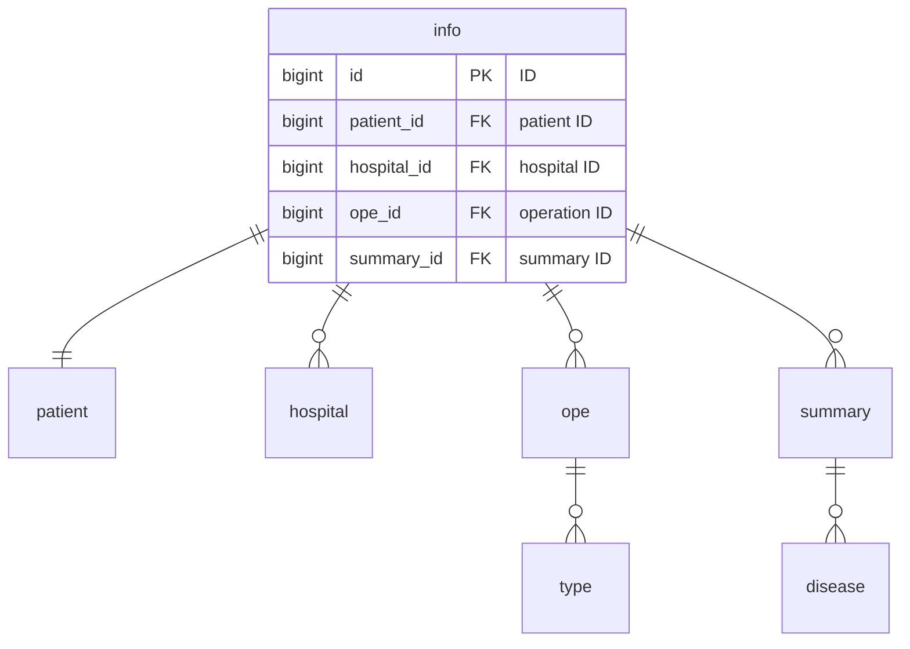

```mermaid

---
title:"aaa"
---

erDiagram
    info ||--|| patient : ""
    info ||--o{ hospital : ""
    info ||--o{ ope : ""
    info ||--o{ summary : ""
    summary ||--o{ disease : ""
    ope ||--o{ type : ""

    info {
        bigint id PK "ID"
        bigint patient_id FK "patient ID"
        bigint hospital_id FK "hospital ID"
        bigint ope_id FK "operation ID"
        bigint summary_id FK "summary ID"
    }
```